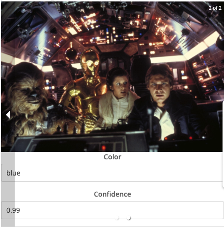

## Front-End Workshop Carousel Exercise

This widget is built as part of the Front-End workshop. It features a carousel based on [react-responsive-carousel](https://www.npmjs.com/package/react-responsive-carousel). Topics for discussion include repeatable containment, including NPM modules, pluggable widget styling, datasources, rendering functions.

## Features

The finished product will provide a swipeable carousel whose content can be modeled in Mendix Studio Pro via datasources and widgets.

## Issues, suggestions and feature requests

https://github.com/cdcharlebois/ww-carousel/issues
